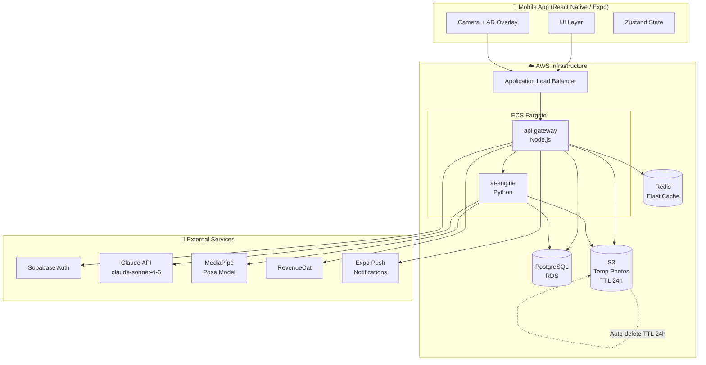
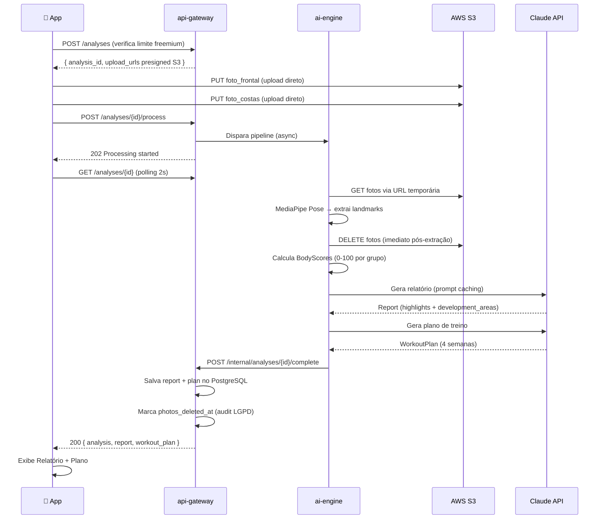
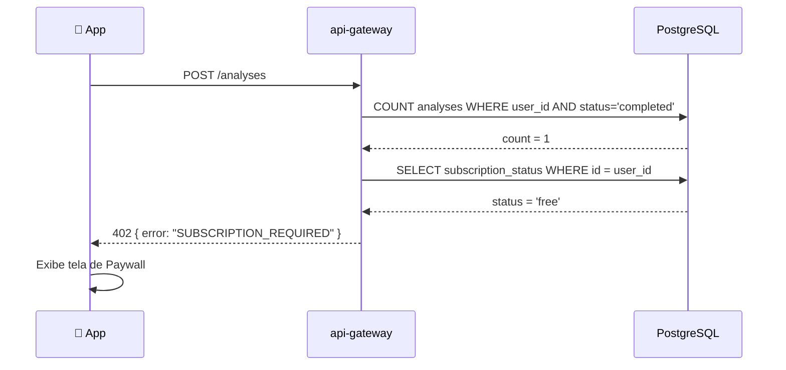
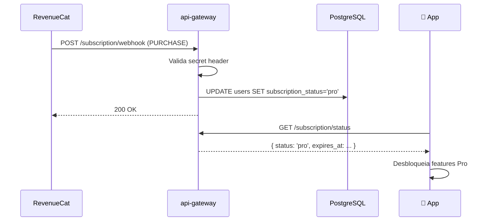

# ShapeAI — Fullstack Architecture Document

**Versão:** 1.0 | **Data:** Abril 2026 | **Status:** Aprovado  
**Autor:** Aria (@architect) | **Input:** PRD ShapeAI v1.0 (Morgan @pm)

---

## Change Log

| Data | Versão | Descrição | Autor |
|------|--------|-----------|-------|
| Abr 2026 | 1.0 | Versão inicial aprovada | Aria (@architect) |

---

## 1. Introdução

Este documento define a arquitetura completa do ShapeAI — app mobile de análise de shape corporal por foto com geração de plano de treino personalizado via IA. Serve como fonte única de verdade técnica para o time de desenvolvimento.

**Starter Template:** N/A — Greenfield project. Monorepo com Expo (React Native) + Node.js + Python, sem template base.

---

## 2. High Level Architecture

### Technical Summary

O ShapeAI é uma aplicação mobile-first construída sobre uma arquitetura de microserviços leves em monorepo. O app React Native (Expo) se comunica com um API Gateway em Node.js que orquestra dois serviços especializados: o `ai-engine` (Python) para processamento de visão computacional e geração de conteúdo via LLM, e o `storage-service` para gestão efêmera de fotos com política de deleção imediata pós-análise. A infraestrutura roda integralmente na AWS (ECS Fargate, RDS PostgreSQL, S3), com RevenueCat gerenciando assinaturas e Supabase Auth provendo identidade. A arquitetura prioriza privacy-by-design — fotos nunca são armazenadas permanentemente — e prompt caching no Claude API para reduzir latência e custo na geração de relatórios.

### Decisão: On-device vs Server-side (MediaPipe)

**Escolha: Server-side para MVP.**

| Opção | Vantagens | Desvantagens |
|-------|-----------|-------------|
| **Server-side** ✓ | Sem dependência de hardware do device, modelo centralizado e atualizável, menor tamanho do app | Latência de rede, custo de compute |
| **On-device** | Zero latência de rede, privacidade máxima | Bundle +50MB, fragmentação de dispositivos, difícil atualizar modelo |

On-device como otimização de Fase 2.

### Platform & Infrastructure

**Plataforma:** AWS

| Serviço AWS | Uso |
|------------|-----|
| ECS Fargate | Containers: api-gateway + ai-engine |
| RDS PostgreSQL 15 | Banco principal (usuários, análises, planos) |
| S3 | Armazenamento temporário de fotos (TTL 24h via lifecycle policy) |
| ElastiCache Redis | Cache de sessão e rate limiting |
| CloudWatch | Logs e métricas |
| ECR | Registry de containers |
| ALB | Load balancer para api-gateway |

### Architecture Diagram



### Architectural Patterns

- **API Gateway Pattern:** Single entry point via `api-gateway` — centraliza auth, rate limiting e roteamento para `ai-engine`
- **Pipeline Pattern:** Foto → S3 → MediaPipe → Score → Claude → Relatório/Plano — cada etapa isolada e rastreável
- **Privacy-by-Design:** Fotos deletadas do S3 imediatamente após extração de landmarks pelo `ai-engine`
- **Prompt Caching:** Template base do relatório cacheado no Claude API — reduz tokens e latência em ~60% nas re-análises
- **Event-driven Notifications:** Notificações mensais disparadas por job agendado (não request-response)

---

## 3. Tech Stack

| Categoria | Tecnologia | Versão | Propósito | Rationale |
|-----------|-----------|--------|-----------|-----------|
| Mobile Language | TypeScript | 5.x | Linguagem principal do app | Type safety, compartilhamento de tipos com backend |
| Mobile Framework | React Native (Expo) | SDK 52 | App iOS + Android em codebase única | Menor custo de manutenção, OTA updates via Expo |
| UI Components | React Native Paper | 5.x | Design system mobile | Material Design 3, acessibilidade nativa |
| Camera / AR | expo-camera + Vision Camera | 4.x | Captura de foto + overlay AR | Acesso à câmera nativa com performance adequada |
| State Management | Zustand | 4.x | Estado global do app | Leve, sem boilerplate, ideal para apps mobile |
| Navigation | React Navigation | 6.x | Rotas e deep links | Padrão de mercado React Native |
| API Client | Axios + React Query | 5.x | Chamadas HTTP + cache | React Query gerencia loading/error/cache automaticamente |
| Backend Language | TypeScript (Node.js) | 20 LTS | API Gateway | Compartilha tipos com mobile via pacote shared |
| Backend Framework | Fastify | 4.x | API Gateway REST | Mais rápido que Express, schema validation nativo |
| AI Engine Language | Python | 3.12 | Processamento Vision AI + LLM | Ecossistema ML/AI dominante |
| AI Engine Framework | FastAPI | 0.115 | API interna do ai-engine | Async nativo, alta performance |
| Vision AI | MediaPipe Pose | 0.10 | Body landmark detection | Google-maintained, server-side sem GPU dedicada |
| LLM | Claude API (claude-sonnet-4-6) | latest | Geração de relatório + plano | Melhor custo-benefício PT-BR, prompt caching nativo |
| Database | PostgreSQL | 15 | Dados estruturados | ACID, JSONB para scores flexíveis, RDS gerenciado |
| Cache | Redis (ElastiCache) | 7.x | Cache de sessão e rate limiting | Reduz carga no RDS |
| File Storage | AWS S3 | — | Armazenamento temporário de fotos (TTL 24h) | Lifecycle policy para deleção automática |
| Auth | Supabase Auth | 2.x | Autenticação email + Google + Apple | JWT gerenciado, OAuth integrado |
| Subscriptions | RevenueCat | SDK 7.x | Gestão de assinaturas iOS + Android | Abstrai complexidade App Store / Google Play |
| Push Notifications | Expo Push Notifications | — | Notificações mensais | Integrado ao Expo, iOS + Android |
| Mobile Testing | Jest + RNTL | — | Testes unitários e de componentes | Padrão React Native |
| Backend Testing | Vitest + Supertest | — | Testes unitários e de integração | Mais rápido que Jest para Node.js |
| AI Engine Testing | Pytest | 8.x | Testes do pipeline de análise | Padrão Python |
| Monorepo Tool | Turborepo | 2.x | Orquestração do monorepo | Cache de builds, execução paralela |
| Containerization | Docker + ECS Fargate | — | Deploy dos serviços backend | Serverless containers |
| CI/CD | GitHub Actions | — | Pipeline de build, test e deploy | Integrado ao repositório |
| IaC | Terraform | 1.9 | Provisionamento AWS | Reproducível, versionado |
| Monitoring | CloudWatch + Sentry | — | Logs, métricas e error tracking | CloudWatch nativo AWS; Sentry para erros |
| Styling | StyleSheet + Styled Components | — | Estilização do app mobile | StyleSheet nativo + temas |

---

## 4. Data Models

### Decisão: Scores de Análise — JSONB

Scores armazenados como JSONB no PostgreSQL para permitir evolução dos grupos musculares analisados sem migrations. Exemplo:

```json
{
  "shoulders": 72, "chest": 58, "back": 81,
  "arms": 64, "core": 45, "legs": 69,
  "posture_score": 77, "symmetry_score": 83
}
```

### TypeScript Interfaces (packages/shared)

```typescript
interface User {
  id: string;
  email: string;
  created_at: Date;
  subscription_status: 'free' | 'pro';
  subscription_expires_at: Date | null;
  revenuecat_id: string | null;
}

interface UserProfile {
  id: string;
  user_id: string;
  height_cm: number;
  weight_kg: number;
  biological_sex: 'M' | 'F';
  primary_goal: 'hypertrophy' | 'fat_loss' | 'conditioning';
  updated_at: Date;
}

interface BodyScores {
  shoulders: number; chest: number; back: number;
  arms: number; core: number; legs: number;
  posture_score: number; symmetry_score: number;
}

interface Analysis {
  id: string;
  user_id: string;
  status: 'processing' | 'completed' | 'failed';
  photo_front_url: string | null;   // nullificada após deleção
  photo_back_url: string | null;    // nullificada após deleção
  photos_deleted_at: Date | null;   // audit trail LGPD
  scores: BodyScores;
  created_at: Date;
  completed_at: Date | null;
}

interface ReportSection {
  muscle_group: string;
  title: string;
  description: string;
  score: number;
}

interface Report {
  id: string;
  analysis_id: string;
  highlights: ReportSection[];
  development_areas: ReportSection[];
  generated_at: Date;
}

interface Exercise {
  name: string;
  sets: number;
  reps: string;
  rest_seconds: number;
  notes: string | null;
}

interface WorkoutSession {
  day: string;
  focus: string;
  exercises: Exercise[];
}

interface WorkoutWeek {
  week_number: number;
  sessions: WorkoutSession[];
}

interface WorkoutPlan {
  id: string;
  analysis_id: string;
  user_id: string;
  duration_weeks: number;
  sessions_per_week: number;
  weeks: WorkoutWeek[];
  generated_at: Date;
}

interface PushToken {
  id: string;
  user_id: string;
  token: string;
  platform: 'ios' | 'android';
  created_at: Date;
}
```

### Database Schema (PostgreSQL DDL)

```sql
CREATE TABLE users (
  id UUID PRIMARY KEY,
  email TEXT NOT NULL UNIQUE,
  subscription_status TEXT NOT NULL DEFAULT 'free'
    CHECK (subscription_status IN ('free', 'pro')),
  subscription_expires_at TIMESTAMPTZ,
  revenuecat_id TEXT,
  created_at TIMESTAMPTZ NOT NULL DEFAULT NOW()
);

CREATE TABLE user_profiles (
  id UUID PRIMARY KEY DEFAULT gen_random_uuid(),
  user_id UUID NOT NULL REFERENCES users(id) ON DELETE CASCADE,
  height_cm SMALLINT NOT NULL CHECK (height_cm BETWEEN 100 AND 250),
  weight_kg NUMERIC(5,1) NOT NULL CHECK (weight_kg BETWEEN 30 AND 300),
  biological_sex CHAR(1) NOT NULL CHECK (biological_sex IN ('M', 'F')),
  primary_goal TEXT NOT NULL
    CHECK (primary_goal IN ('hypertrophy', 'fat_loss', 'conditioning')),
  updated_at TIMESTAMPTZ NOT NULL DEFAULT NOW(),
  UNIQUE(user_id)
);

CREATE TABLE analyses (
  id UUID PRIMARY KEY DEFAULT gen_random_uuid(),
  user_id UUID NOT NULL REFERENCES users(id) ON DELETE CASCADE,
  status TEXT NOT NULL DEFAULT 'processing'
    CHECK (status IN ('processing', 'completed', 'failed')),
  photo_front_url TEXT,
  photo_back_url TEXT,
  photos_deleted_at TIMESTAMPTZ,
  scores JSONB,
  created_at TIMESTAMPTZ NOT NULL DEFAULT NOW(),
  completed_at TIMESTAMPTZ
);

CREATE INDEX idx_analyses_user_id ON analyses(user_id);
CREATE INDEX idx_analyses_created_at ON analyses(created_at DESC);

CREATE TABLE reports (
  id UUID PRIMARY KEY DEFAULT gen_random_uuid(),
  analysis_id UUID NOT NULL REFERENCES analyses(id) ON DELETE CASCADE,
  highlights JSONB NOT NULL,
  development_areas JSONB NOT NULL,
  generated_at TIMESTAMPTZ NOT NULL DEFAULT NOW(),
  UNIQUE(analysis_id)
);

CREATE TABLE workout_plans (
  id UUID PRIMARY KEY DEFAULT gen_random_uuid(),
  analysis_id UUID NOT NULL REFERENCES analyses(id) ON DELETE CASCADE,
  user_id UUID NOT NULL REFERENCES users(id) ON DELETE CASCADE,
  duration_weeks SMALLINT NOT NULL CHECK (duration_weeks BETWEEN 4 AND 6),
  sessions_per_week SMALLINT NOT NULL CHECK (sessions_per_week BETWEEN 3 AND 5),
  weeks JSONB NOT NULL,
  generated_at TIMESTAMPTZ NOT NULL DEFAULT NOW(),
  UNIQUE(analysis_id)
);

CREATE TABLE push_tokens (
  id UUID PRIMARY KEY DEFAULT gen_random_uuid(),
  user_id UUID NOT NULL REFERENCES users(id) ON DELETE CASCADE,
  token TEXT NOT NULL UNIQUE,
  platform TEXT NOT NULL CHECK (platform IN ('ios', 'android')),
  created_at TIMESTAMPTZ NOT NULL DEFAULT NOW()
);

CREATE VIEW user_analysis_count AS
  SELECT user_id, COUNT(*) as completed_analyses
  FROM analyses
  WHERE status = 'completed'
  GROUP BY user_id;
```

---

## 5. API Specification

**Base URL:** `https://api.shapeai.app/v1`  
**Auth:** Bearer JWT (Supabase) em todos os endpoints exceto webhooks internos.

### Endpoints

| Método | Endpoint | Descrição |
|--------|----------|-----------|
| GET | `/profile` | Retorna perfil do usuário |
| POST | `/profile` | Cria perfil (onboarding) |
| PATCH | `/profile` | Atualiza perfil |
| GET | `/analyses` | Lista análises (histórico, paginado) |
| POST | `/analyses` | Inicia nova análise + presigned URLs S3 |
| GET | `/analyses/{id}` | Status e resultado da análise |
| POST | `/analyses/{id}/process` | Dispara processamento pós-upload |
| POST | `/analyses/compare` | Comparativo entre duas análises |
| GET | `/subscription/status` | Status da assinatura |
| POST | `/subscription/webhook` | Webhook RevenueCat (auth por secret) |
| POST | `/push-tokens` | Registra token de push |
| DELETE | `/users/me` | Direito ao esquecimento (LGPD) |
| GET | `/users/me/export` | Portabilidade de dados (LGPD) |
| POST | `/internal/analyses/{id}/complete` | ai-engine → conclusão da análise |

---

## 6. Core Workflows

### Workflow 1: Análise Completa (Happy Path)



### Workflow 2: Enforcement Freemium



### Workflow 3: Atualização de Assinatura



---

## 7. Project Structure

```plaintext
shapeai/
├── .github/
│   └── workflows/
│       ├── ci.yaml
│       └── deploy.yaml
├── apps/
│   └── mobile/
│       ├── src/
│       │   ├── components/
│       │   │   ├── camera/       # AROverlay, CaptureButton
│       │   │   ├── report/       # ScoreCard, HighlightCard
│       │   │   ├── workout/      # SessionCard, ExerciseItem
│       │   │   └── ui/           # Button, Card, Badge, Disclaimer
│       │   ├── screens/
│       │   │   ├── OnboardingScreen.tsx
│       │   │   ├── HomeScreen.tsx
│       │   │   ├── CameraScreen.tsx
│       │   │   ├── AnalysisLoadingScreen.tsx
│       │   │   ├── ReportScreen.tsx
│       │   │   ├── WorkoutPlanScreen.tsx
│       │   │   ├── HistoryScreen.tsx
│       │   │   ├── CompareScreen.tsx
│       │   │   ├── PaywallScreen.tsx
│       │   │   └── ProfileScreen.tsx
│       │   ├── navigation/
│       │   ├── stores/
│       │   │   ├── auth.store.ts
│       │   │   ├── analysis.store.ts
│       │   │   └── subscription.store.ts
│       │   ├── services/
│       │   │   ├── api.client.ts
│       │   │   ├── analysis.service.ts
│       │   │   ├── profile.service.ts
│       │   │   └── subscription.service.ts
│       │   └── hooks/
│       │       ├── useAnalysis.ts
│       │       ├── useCamera.ts
│       │       └── useSubscription.ts
│       └── app.json
├── services/
│   ├── api-gateway/              # Node.js + Fastify
│   │   └── src/
│   │       ├── routes/
│   │       │   ├── analyses.ts
│   │       │   ├── profile.ts
│   │       │   ├── subscription.ts
│   │       │   └── push-tokens.ts
│   │       ├── middleware/
│   │       │   ├── auth.ts       # Valida JWT Supabase
│   │       │   └── rate-limit.ts
│   │       ├── services/
│   │       │   ├── freemium.service.ts
│   │       │   ├── s3.service.ts
│   │       │   └── notification.service.ts
│   │       └── db/
│   │           ├── client.ts
│   │           └── migrations/
│   └── ai-engine/                # Python + FastAPI
│       └── src/
│           ├── routers/
│           │   └── analysis.py
│           ├── pipeline/
│           │   ├── mediapipe_processor.py
│           │   ├── score_calculator.py
│           │   ├── report_generator.py
│           │   └── plan_generator.py
│           └── privacy/
│               └── photo_cleaner.py
├── packages/
│   └── shared/
│       └── src/types/
│           ├── analysis.types.ts
│           ├── user.types.ts
│           └── workout.types.ts
├── infrastructure/
│   └── terraform/
│       ├── main.tf
│       ├── variables.tf
│       └── environments/
│           ├── staging.tfvars
│           └── prod.tfvars
├── docs/shapeai/
│   ├── brief-shapeai.md
│   ├── prd-shapeai.md
│   └── architecture-shapeai.md
├── turbo.json
├── package.json
└── .env.example
```

---

## 8. Security & Privacy

### Token Storage (Mobile)
JWT armazenado via `expo-secure-store` (Keychain iOS / Keystore Android) — nunca em AsyncStorage.

### Rate Limiting (Backend)

```typescript
const rateLimits = {
  'POST /analyses':           { max: 10, window: '1h' },
  'POST /analyses/*/process': { max: 5,  window: '1h' },
  'default':                  { max: 100, window: '1m' }
}
```

### LGPD / Privacy Compliance

| Requisito | Implementação |
|-----------|--------------|
| Consentimento explícito | Checkbox obrigatório no onboarding para uso de fotos |
| Deleção de fotos | S3 lifecycle TTL 24h + deleção ativa pelo ai-engine pós-extração |
| Audit trail | `photos_deleted_at` em cada análise |
| Dados biométricos | Não armazenados — apenas scores numéricos derivados |
| Direito ao esquecimento | `DELETE /users/me` com cascade completo |
| Portabilidade | `GET /users/me/export` retorna JSON com todos os dados |
| DPA | Consulta jurídica pré-lançamento |

### Environment Variables

```bash
# api-gateway
DATABASE_URL=postgresql://...
SUPABASE_JWT_SECRET=...
AWS_ACCESS_KEY_ID=...
AWS_SECRET_ACCESS_KEY=...
AWS_S3_BUCKET=shapeai-photos-{env}
AWS_REGION=us-east-1
REVENUECAT_WEBHOOK_SECRET=...
AI_ENGINE_URL=http://ai-engine:8000
AI_ENGINE_SECRET=...
REDIS_URL=redis://...

# ai-engine
AWS_ACCESS_KEY_ID=...
AWS_SECRET_ACCESS_KEY=...
AWS_S3_BUCKET=shapeai-photos-{env}
ANTHROPIC_API_KEY=...
API_GATEWAY_URL=http://api-gateway:3000
INTERNAL_SECRET=...
```

---

## 9. Next Steps

### UX Expert Handoff

> @ux-design-expert — Arquitetura aprovada. Foco nas telas críticas: **CameraScreen** (AR overlay com silhueta + detecção de figura humana), **ReportScreen** (cards de score visual por grupo muscular) e **PaywallScreen** (comparativo Free vs Pro). Mobile Only, iOS + Android, React Native Paper como design system.

### Developer Handoff

> @dev — Iniciar com **Epic 1, Story 1.1** (Project Foundation). Monorepo Turborepo com `apps/mobile` (Expo SDK 52), `services/api-gateway` (Fastify + Node 20), `services/ai-engine` (FastAPI + Python 3.12). Consultar `docs/shapeai/architecture-shapeai.md` para estrutura de pastas e stack completa.

---

*Gerado por Aria (@architect) — AIOS Architect Agent*  
*Input: PRD ShapeAI v1.0 (Morgan @pm)*  
*Synkra AIOS v4.0*
